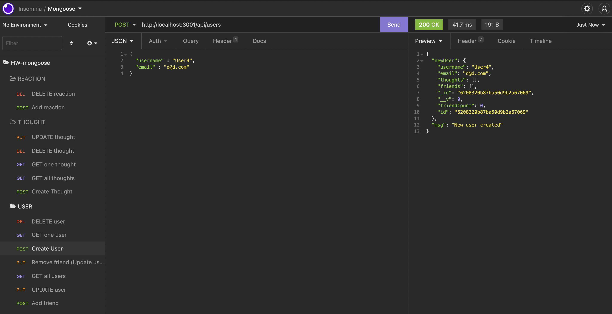

<div style="text-align:center"></a></div>

# social-network-api


<br>

An API for a social network web app using Express.js, MongoDB and Mongoose.

<br>

# Table of Contents

- [Project Link](#project-link)
- [Getting Started](#getting-started)
- [User Story](#user-story)
- [Motivation](#motivation)
- [Acceptance Criteria](#acceptance-criteria)
- [License](#license)
  <br>
  <br>

## Project Link

- project content on [Github](https://github.com/jitasek/social-network-api/tree/dev)
- [walkthrough video - part 1](https://watch.screencastify.com/)
- [walkthrough video - part 2](https://watch.screencastify.com/)

<br>

## Getting Started

Please type the following commands in the terminal in the respective order:

```
git clone git@github.com:jitasek/social-network-api.git
cd social-network-api
code .
git checkout dev
npm i
npm run dev
```

Once done and your server is up and running, you can open Insomnia and check the CRUD operations.

<br>

## User Story

As a social media startup I want an API for my social network that uses a NoSQL database so that my website can handle large amounts of unstructured data.
<br>
<br>

## Motivation

The purpose of this app is to practice working with MongoDB, mongoose, Express.js, npm, Insomnia, and more.
<br>
<br>

## Acceptance Criteria

WHEN I enter the command to invoke the application, my server is started and the Mongoose models are synced to the MongoDB database.

WHEN I open API GET routes in Insomnia for users and thoughts, the data for each of these routes is displayed in a formatted JSON.

WHEN I test API POST, PUT, and DELETE routes in Insomnia, I am able to successfully create, update, and delete users and thoughts in my database.

WHEN I test API POST and DELETE routes in Insomnia, I am able to successfully create and delete reactions to thoughts and add and remove friends to a user’s friend list.

<br>
<br>

## License

This application uses the MIT license.
